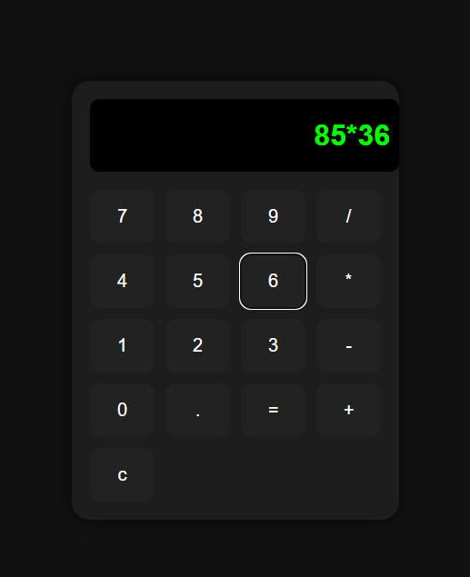

# React Calculator 🖥️

A sleek, modern calculator web app built with **React**, **Vite** and styled using a **Dark-Mode theme** with animated buttons.  
Ideal for validating skills in frontend development, UI/UX design and state handling.

---

## 🚀 Features
- ➕ Basic arithmetic operations: addition (+), subtraction (-), multiplication (×), division (÷)
- 🧹 Clear input (“C” button) and equals (“=”) evaluation
- 🏁 Keyboard support for digits and operators
- 🌗 Dark modern UI with responsive design
- 🖱️ Hover effect animations on buttons

---

## 🛠 Tech Stack
| Technology | Purpose |
|-----------|---------|
| React (Vite) | Front-end architecture |
| CSS (Dark Theme) | UI styling & animations |
| JavaScript (ES6) | Logic & state management |
| Fetch (or none) | Not used in this version |

---

## 📸 Screenshots
### 🖥 UI Preview

## 🔧 How to Run Locally
- git clone https://github.com/arakhitasabata635/react-calculator
- cd react-calculator
- npm install
- npm run dev

## 🧠 What I Learned
- React hooks (useState, maybe useEffect)
- Handling calculator logic & input parsing
- Designing a responsive, modern dark UI
- Adding hover/active state animations for better UX